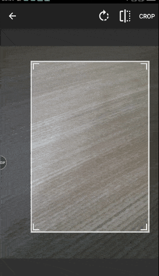
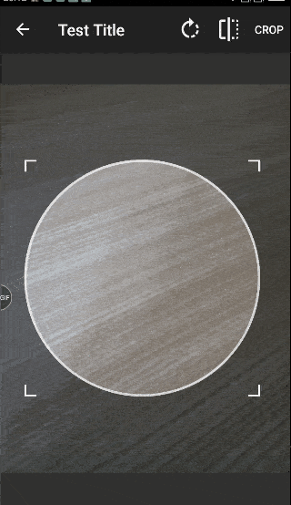
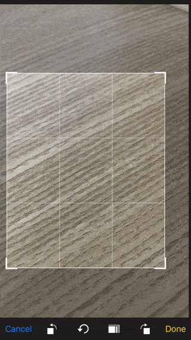
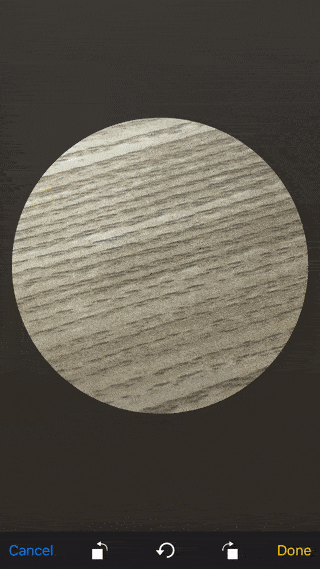

# Introduction 
.NET MAUI plugin to crop and rotate photos.

Ported over from : https://github.com/stormlion227/ImageCropper.Forms

Supports Android and iOS.
* Android library from : https://github.com/CanHub/Android-Image-Cropper
* iOS library from : https://github.com/TimOliver/TOCropViewController

## Features

* Cropping image.
* Rotating image.
* Aspect ratio.
* Circle/Rectangle shape.

## Screen-Shots

### Android
 

### iOS
 


## Setup

### Android

Add the following to your AndroidManifest.xml inside the <application> tags:
```xml	
	<activity android:name="com.canhub.cropper.CropImageActivity"
	          android:theme="@style/Base.Theme.AppCompat"/>	
```

In MainActivity.cs file:
```cs
	protected override void OnCreate(Bundle savedInstanceState)
	{
	    new ImageCropper.Maui.Platform.Init(this);
	
	    base.OnCreate(savedInstanceState);
	}
```

### iOS

In AppDelegate.cs file:

```cs
	public override bool FinishedLaunching(UIApplication application, NSDictionary launchOptions)
        {
            new ImageCropper.Maui.Platform.Init();

            return base.FinishedLaunching(application, launchOptions);
        }
```
## Usage

Before calling the code below, you should request the required permissions for accessing camera and gallery first.

```cs
    new ImageCropper()
    {
        Success = (imageFile) =>
        {
            Dispatcher.Dispatch(() =>
            {
                imageView.Source = ImageSource.FromFile(imageFile);
            });
        }
    }.Show(imageFileName);
```
### Properties
* PageTitle
* AspectRatioX
* AspectRatioY
* CropShape


# Build and Test
TODO: Describe and show how to build your code and run the tests. 

# Contribute
TODO: Explain how other users and developers can contribute to make your code better. 

If you want to learn more about creating good readme files then refer the following [guidelines](https://docs.microsoft.com/en-us/azure/devops/repos/git/create-a-readme?view=azure-devops). You can also seek inspiration from the below readme files:
- [ASP.NET Core](https://github.com/aspnet/Home)
- [Visual Studio Code](https://github.com/Microsoft/vscode)
- [Chakra Core](https://github.com/Microsoft/ChakraCore)
